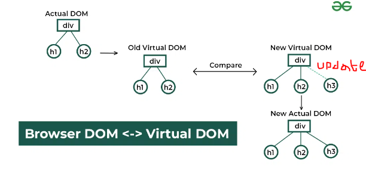

```text
🎁Virtual DOM
```


```text
//Virtual DOM is not a browser technology, it is a mechanism used by React Technologies.
//React Application is very fast because of Virtual DOM.
//Actuall React keeps a copy of Actual DOM/Real DOM in browser memory that DOM is called as "Virtual DOM".
//Virtual DOM is a JSON object that stored in browser memory (Application runtime enviornment).
//Virtual DOM is not a physical structure like Real DOM but rather a lightweight representation of DOM.
//The Virtual DOM exists as a data structure in memory(RAM). It is an abstract tree like object that React
//maintains internally while the application runs.
//The Virtual DOM not strored on hard drive or in a permanent location. It is dynamically created, updated and discarded during the lifecycle of React Application or the app is active or runs in user's browser.

👉When a React application is first loaded, then React builds the "Real DOM/Actual DOM" from the "JSX"
  or "component structure" as well as creates a "Virtual DOM" that "Virtual DOM" represents this
  initial UI in memory.
👉When the Application's "state" and "props" gets changed then React does not immediately update the 
  changes in "Real DOM". Instead, it creates a new "Virtual DOM" that newely created "Virtual DOM"
  represents to update the changes in UI. Then React compares the Previous Virtual DOM(before update created), with the new Virtual DOM to find the "changes" or "differnces" this process is called as "diffing"(diff algorithm).

👉After detecting the "changes/differnces" between the old and new Virtual DOM, then react updates the 
   necessary parts of the Real DOM. During this process react avoids re-rendering the entire DOM and 
   reducing the performance cost.
👉The process of compairing the old and new Virtual DOM and updating the necessary parts of the real DOM,
   called as "Reconciliation". 
```